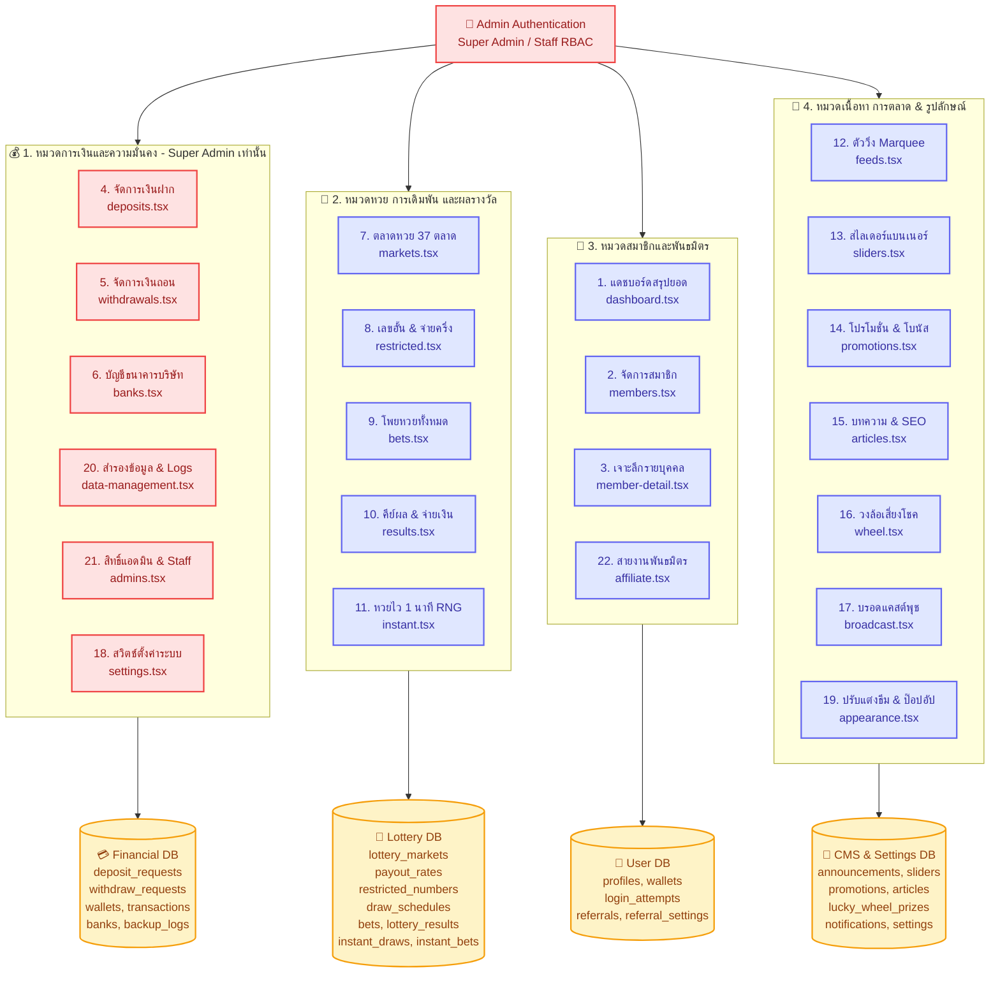
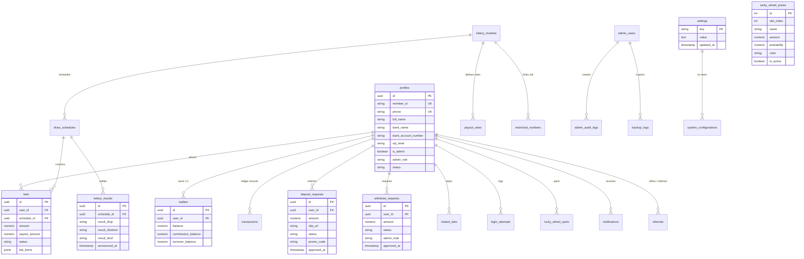
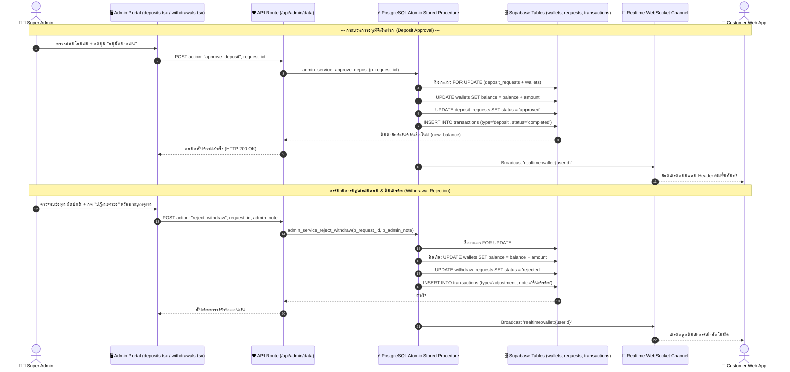
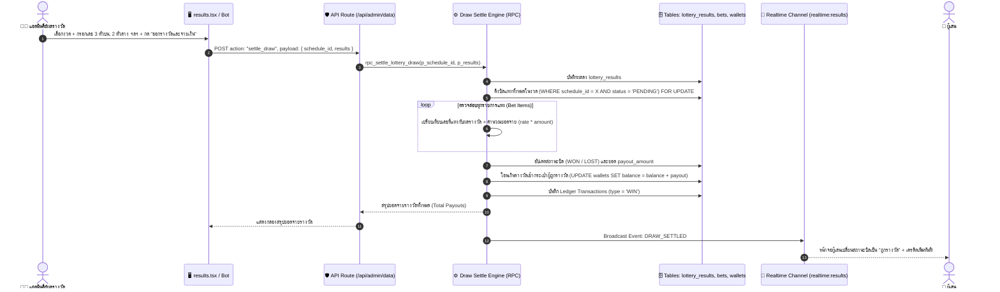

# 🏛️ THLOTTO-II — ADMIN DATA MANAGEMENT & UI ARCHITECTURE DIAGRAMS
**เอกสารประกอบการออกแบบ UI/UX และผังข้อมูลระบบหลังบ้าน (Admin Portal)**  
**มาตรฐาน:** ARM AI Engineering Standard (ARM-AES v1.0) & [docs/SYSTEM_BLUEPRINT.md](file:///c:/Users/armyn/Downloads/THLOTTO-II/docs/SYSTEM_BLUEPRINT.md)  
**Database:** Supabase PostgreSQL 15 (`ygopnjbvccenryejqmlw`)

---

## 1. 🗺️ ภาพรวมสถาปัตยกรรมข้อมูลแอดมิน 22 โมดูล (Admin Functional Topology)

---

## 2. 🗄️ ความสัมพันธ์เชิงโครงสร้างข้อมูลแอดมิน (Entity Relationship Diagram)

---

## 3. ⚙️ ผังกระบวนการจัดการข้อมูลการเงิน (Atomic Financial Processing Flow)

---

## 4. 🎰 ผังกระบวนการออกรางวัลและคิดเงินบิลหวย (Draw Settle Flow)

---

## 5. 📊 เมทริกซ์ 22 โมดูลแอดมิน: ความรับผิดชอบ, สิทธิ์, ตาราง & Actions สำหรับการดีไซน์ UI

| # | โมดูล / ไฟล์ UI | สิทธิ์ (RBAC) | ตาราง Supabase จริง | Actions & RPCs หลัก | องค์ประกอบ UI ที่ควรออกแบบ (Design Elements) |
|---|---|---|---|---|---|
| 1 | **Dashboard** `dashboard.tsx` | Super Admin, Staff | `profiles`, `bets`, `deposit_requests`, `withdraw_requests` | Readonly Analytics | การ์ด KPI รวม, กราฟ BarChart 7 วัน, Top 10 Bettors (แท็บ วันนี้/สัปดาห์/ตลอดกาล), Live Feeds |
| 2 | **Members** `members.tsx` | Super Admin, Staff | `profiles`, `wallets` | `adjust_balance`, `toggle_member_status`, `change_member_vip` | ตารางสมาชิก, Badge สถานะ, ปุ่ม Quick Actions (เติม/ลดเงิน, แบน), ตัวกรอง VIP, ตัวค้นหา Realtime |
| 3 | **Member Detail** `member-detail.tsx` | Super Admin, Staff | `profiles`, `wallets`, `bets`, `transactions`, `login_attempts` | `adjust_balance`, `toggle_status` | ข้อมูลโปรไฟล์ + พิกัด Geo Map, แท็บประวัติแทงหวย, ประวัติการเงิน, ประวัติการเข้าสู่ระบบอุปกรณ์ |
| 4 | **Deposits** `deposits.tsx` | **Super Admin เท่านั้น** | `deposit_requests`, `wallets`, `transactions` | `approve_deposit`, `reject_deposit` (Atomic RPC) | รายการรอตรวจ, Modal ซูมสลิปโอนเงินความละเอียดสูง, ตัวจับเวลาสลิป, ปุ่มกดอนุมัติ/ปฏิเสธแบบ Quick |
| 5 | **Withdrawals** `withdrawals.tsx` | **Super Admin เท่านั้น** | `withdraw_requests`, `wallets`, `transactions` | `approve_withdraw`, `reject_withdraw` (Auto Refund) | รายการรอถอน, เช็กยอดเทิร์นโอเวอร์, ข้อมูลบัญชีผู้รับเงิน, ปุ่มอนุมัติโอน/ปฏิเสธคืนเครดิต |
| 6 | **Banks** `banks.tsx` | **Super Admin เท่านั้น** | `banks`, `settings` | `create_bank`, `update_bank`, `delete_bank`, `toggle_bank_active` | การ์ดสมุดบัญชีธนาคารบริษัท, สวิตช์เปิด-ปิดรับโอน, คอนฟิกยอดฝาก-ถอนต่ำสุด/สูงสุด |
| 7 | **Markets** `markets.tsx` | Super Admin, Staff | `lottery_markets`, `payout_rates` | `toggle_market_status`, `update_payout_rate`, `update_market` | แผง 37 ตลาดหวยจัดกลุ่ม, ตัวนับถอยหลังงวด, ฟอร์มปรับเวลาปิดรับ, ตารางแก้เรทอัตราจ่าย 24 ประเภท |
| 8 | **Restricted** `restricted.tsx` | Super Admin, Staff | `restricted_numbers`, `lottery_markets` | `upsert_restricted_number`, `delete_restricted_number` | ฟอร์มเพิ่มเลขอั้น (ไม่รับแทง) / เลขจ่ายครึ่ง, ตารางกรองตามตลาด, ป้ายแสดงประเภทเลขและอัตราจ่าย |
| 9 | **Bets** `bets.tsx` | Super Admin, Staff | `bets`, `profiles`, `lottery_markets` | `cancel_bet` (Refund to wallet) | ตารางโพยหวยรวม, ฟิลเตอร์สถานะ (รอผล/ถูกรางวัล/ไม่ถูก/ยกเลิก), ดูรายละเอียดตัวเลขย่อยในบิล, ปุ่มยกเลิกบิล |
| 10 | **Results** `results.tsx` | Super Admin, Staff | `lottery_results`, `draw_schedules` | `settle_draw`, `save_draw_result` | หน้าคีย์ผลตัวเลข (3 ตัวบน, 2 ตัวล่าง, โต๊ด, วิ่ง), ตัวพรีวิวคำนวณเงินก่อนกดยืนยัน, ประวัติผลย้อนหลัง |
| 11 | **Instant** `instant.tsx` | Super Admin, Staff | `instant_draws`, `instant_bets`, `instant_bet_types` | `update_instant_bet_type`, `update_instant_settings` | สถิติหวย 1 นาที, กราฟรายชั่วโมง Win/Loss Ratio, ตรวจสอบ Provably Fair Seed Hash, ปรับ Win Rate |
| 12 | **Feeds** `feeds.tsx` | Super Admin, Staff | `announcements`, `trending_items` | `create_announcement`, `update_announcement`, `toggle_announcement` | แผงจัดการตัววิ่ง Marquee หัวเว็บ, สวิตช์เปิด/ปิดตลาดแนะนำ Popular / Trending |
| 13 | **Sliders** `sliders.tsx` | Super Admin, Staff | `sliders` | `create_slider`, `update_slider`, `delete_slider`, `toggle_slider` | อัปโหลดรูปภาพแบนเนอร์ (Desktop/Mobile), จัดลำดับ Drag & Drop, ตั้งค่า Link ปลายทาง |
| 14 | **Promotions** `promotions.tsx` | Super Admin, Staff | `promotions` | `upsert_promotion`, `delete_promotion` | ฟอร์มสร้างโปรโมชั่น, คำนวณโบนัส % หรือ บาท, ตั้งค่าเทิร์นโอเวอร์, ตัวพรีวิวการ์ด Live Preview |
| 15 | **Articles** `articles.tsx` | Super Admin, Staff | `articles` | `create_article`, `update_article`, `delete_article` | Rich Text Editor เขียนแนวทางหวย, ตั้งค่า SEO Slug, รูปภาพ Cover, แท็กหมวดหมู่ |
| 16 | **Wheel** `wheel.tsx` | Super Admin, Staff | `lucky_wheel_prizes`, `lucky_wheel_spins` | `update_wheel_prize`, `update_wheel_config` | พรีวิววงล้อ 8 ช่อง, ปรับแต่งสีและของรางวัล, กำหนดน้ำหนัก Probability % โอกาสออกรางวัล, สรุปประวัติหมุน |
| 17 | **Broadcast** `broadcast.tsx` | Super Admin, Staff | `notifications`, `settings` | `send_broadcast`, `batch_update_settings` | ฟอร์มส่งข้อความพุช (เลือกกระดิ่ง หรือ ป๊อปอัปเด้งกลางจอ), เลือกผู้รับ (ทุกคน/รายคน), คอนฟิกป๊อปอัปหน้าแรก |
| 18 | **Settings** `settings.tsx` | **Super Admin เท่านั้น** | `settings` (109 Keys) | `batch_update_settings` | สวิตช์ปิดปรับปรุง (Maintenance Mode), สวิตช์ Auto Draw Bot, คอนฟิกขั้นต่ำการแทง, คอนฟิกความปลอดภัย |
| 19 | **Appearance** `appearance.tsx` | Super Admin, Staff | `settings` | `update_appearance` | เลือกสีธีม (Color Picker), อัปโหลดโลโก้/Favicon, พรีวิวหน้าล็อกอินแบบจำลอง (Desktop / Mobile) |
| 20 | **Data Mgmt** `data-management.tsx` | **Super Admin เท่านั้น** | `backup_logs`, 24 Supabase Tables | `record_backup`, API Data Export | สถิตินับแถว 24 ตาราง, ปุ่ม Export CSV/JSON รายตาราง, ปุ่ม Full Backup Snapshot, ตารางประวัติ Backup |
| 21 | **Admins** `admins.tsx` | **Super Admin เท่านั้น** | `profiles` (`is_admin`), `admin_roles` | `create_admin`, `update_admin`, `delete_admin_user` | ตารางรายชื่อผู้ดูแล, กำหนด Role (Super Admin / Staff), กำหนดสิทธิ์รายโมดูล (Permissions Checkbox) |
| 22 | **Affiliate** `affiliate.tsx` | Super Admin, Staff | `referrals`, `referral_settings`, `wallets` | `update_referral_settings` | สถิติสายงานแนะนำเพื่อน, ตาราง Top Referrers, ตั้งค่า % ส่วนแบ่งคอมมิชชั่น, ขั้นต่ำการถอนรายได้ |
