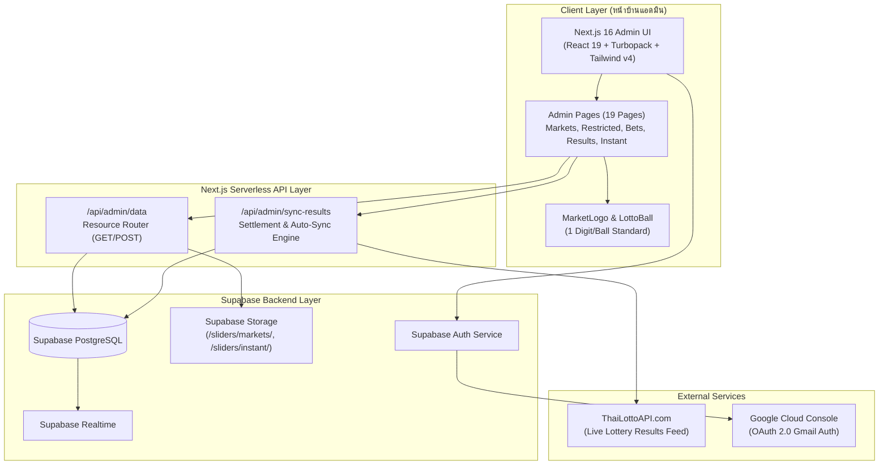

# เอกสารสถาปัตยกรรมระบบ (Architecture Blueprint)

> **TH-LOTTO-II Admin Control Portal**  
> **มาตรฐานวิศวกรรมซอฟต์แวร์: ARM-AES v1.0**

---

## 1. ผังภาพรวมของระบบ (High-Level System Architecture)

---

## 2. ตารางข้อมูลหลักและความสัมพันธ์ (Database Schema & Relations)

### 2.1 ตาราง `public.lottery_markets` (ตลาดหวย 37 ตลาด)
- **Primary Key:** `id (uuid)`
- **คอลัมน์สำคัญ:**
  - `name (text)`: ชื่อทางการตลาดหวย (เช่น "หวยรัฐบาล", "ฮานอยปกติ", "หวยลาวพัฒนา")
  - `code (text)`: รหัสตลาด (เช่น `TH_GOV`, `HANOI`, `LAO`, `MK_1100`, `STOCK_NIKKEI_MORNING`)
  - `category (text)`: หมวดหมู่ (`GOV`, `FOREIGN`, `MAEKHONG`, `STOCK`, `SPEED`)
  - `logo_url (text)`: URL โลโก้ทางการ
  - `image_url (text)`: รูปภาพสำรอง
  - `is_active (boolean)`: สถานะเปิดใช้งานในระบบ (33 ตลาด True, 4 ตลาด False)
  - `is_open (boolean)`: สถานะเปิดรับแทงประจำงวด
  - `closing_time (text)` / `draw_time (time)`: เวลาปิดรับและเวลาออกผล
  - `stream_url (text)`: ลิงก์ YouTube Live ถ่ายทอดสด

### 2.2 ตาราง `public.restricted_numbers` (จัดการเลขอั้น)
- **Primary Key:** `id (uuid)`
- **Foreign Key:** `market_id -> lottery_markets.id` (Constraint: `restricted_numbers_market_id_fkey`)
- **คอลัมน์สำคัญ:**
  - `bet_type (text)`: รูปแบบการแทง (`3TOP`, `2BOTTOM`, `2TOP`, ฯลฯ)
  - `number (text)`: ตัวเลขที่ถูกอั้น
  - `max_amount (numeric)`: เพดานยอดรับแทงสูงสุด (0 = ไม่รับแทง)
  - `payout_rate (numeric)`: อัตราจ่ายพิเศษ (0 = ปิดรับแทง, >0 = จ่ายครึ่ง)
  - `draw_date (date)`: งวดวันที่บังคับใช้

### 2.3 ตาราง `public.bets` (โพยแทงหวยของสมาชิก)
- **Primary Key:** `id (uuid)`
- **Foreign Keys:**
  - `user_id -> profiles.id` (Constraint: `bets_profile_fkey`)
  - `market_id -> lottery_markets.id` (Constraint: `bets_market_id_fkey`)
- **คอลัมน์สำคัญ:**
  - `bet_no (text)`: รหัสโพยแทง
  - `numbers (text)`: ตัวเลขที่แทง (จัดเก็บเป็น String เช่น "915")
  - `amount (numeric)`: ยอดเงินที่แทง
  - `payout_amount (numeric)`: เงินรางวัลที่ได้รับเมื่อชนะ
  - `status (text)`: `PENDING`, `WON`, `LOST`, `CANCELLED`

### 2.4 ตาราง `public.lottery_results` (ผลรางวัล)
- **Primary Key:** `id (uuid)`
- **Foreign Key:** `market_id -> lottery_markets.id` (Constraint: `lottery_results_market_id_fkey`)
- **คอลัมน์สำคัญ:**
  - `draw_date (text)`: งวดวันที่ออกผล
  - `result_3top (text)`: ผล 3 ตัวบน
  - `result_2bottom (text)`: ผล 2 ตัวล่าง
  - `result_main (text)`: รางวัลเต็ม 6 หลัก
  - `announced_at (timestamptz)`: วันเวลาที่ออกผลจริง
  - `status (text)`: `SETTLED`, `PENDING`

---

## 3. กลไกการซิงก์ผลรางวัลและตัดยอดเงิน (Sync & Settlement Pipeline)

1. แอดมินกดปุ่ม **"ดึงผลสด ThaiLottoAPI ทันที"** บนหน้า `results` หรือระบบรัน Background Sync
2. `POST /api/admin/sync-results` ดึงข้อมูล JSON จาก `https://thailottoapi.com/api/results`
3. ระบบจับคู่ชื่อและรหัสตลาดเข้ากับ `public.lottery_markets`
4. ทำการ `upsert` ผลรางวัลลงใน `public.lottery_results`
5. รันกระบวนการตรวจผลโพยแทงในตาราง `public.bets` ที่มี `status = 'PENDING'`:
   - หากเลขตรงกับเงื่อนไข คำนวณ `payout_amount = amount * payout_rate` และเปลี่ยนสถานะเป็น `WON`
   - ปรับยอดเครดิตใน `public.profiles.balance` ให้แก่สมาชิกทันที
   - หากไม่ถูกรางวัล ปรับสถานะเป็น `LOST`
