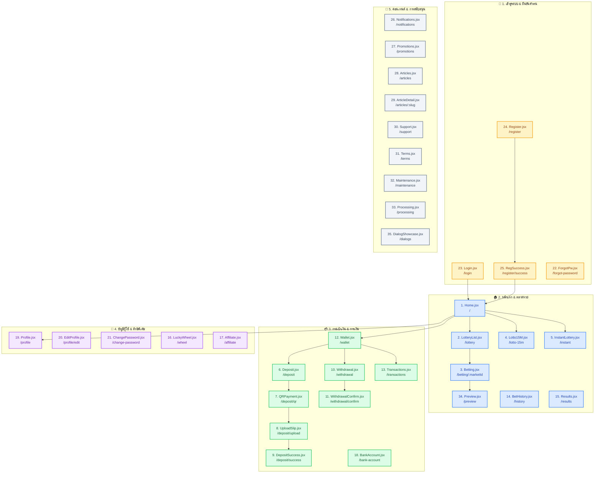
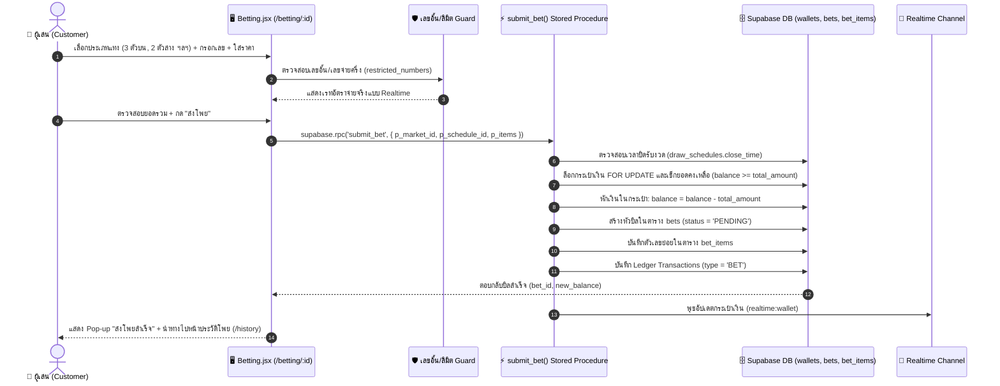
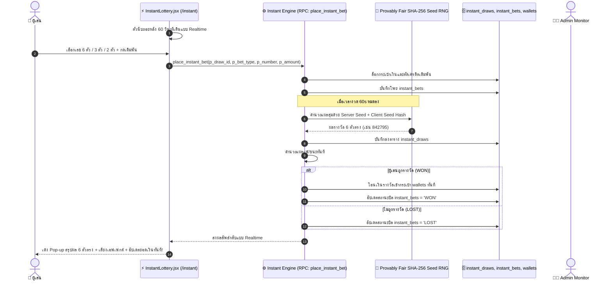

# 📱 THLOTTO-II — CUSTOMER APPLICATION & UI ARCHITECTURE DIAGRAMS
**เอกสารประกอบการออกแบบ UI/UX ผังการใช้งาน และโครงสร้างข้อมูลฝั่งผู้เล่น (Customer App 35 Pages)**  
**มาตรฐาน:** ARM AI Engineering Standard (ARM-AES v1.0) & [docs/SYSTEM_BLUEPRINT.md](file:///c:/Users/armyn/Downloads/THLOTTO-II/docs/SYSTEM_BLUEPRINT.md)  
**Tech Stack:** React 19, Vite 6, Tailwind CSS, Supabase BaaS (`ygopnjbvccenryejqmlw`)

---

## 1. 🗺️ ผังเส้นทางการใช้งานของผู้เล่น (Customer User Journey & Page Map)



---

## 2. 🧾 ผังกระบวนการส่งโพยแทงหวยมาตรฐาน (Standard Lottery Betting Flow)



---

## 3. ⚡ ผังหวยสปีด 1 นาที Provably Fair RNG (Instant Lottery Flow)



---

## 4. 💳 ผังกระบวนการฝาก-ถอนเงินของผู้เล่น (Deposit & Withdraw Journey)

```mermaid
graph TD
    classDef dep fill:#dcfce7,stroke:#22c55e,stroke-width:2px,color:#166534;
    classDef wth fill:#fee2e2,stroke:#ef4444,stroke-width:2px,color:#991b1b;
    classDef bank fill:#dbeafe,stroke:#3b82f6,stroke-width:2px,color:#1e40af;

    subgraph DEP_FLOW [💰 กระบวนการฝากเงิน (Deposit Flow)]
        D1[Deposit.jsx<br/>เลือกธนาคารบริษัท + ใส่จำนวนเงิน]:::dep
        D2[QRPayment.jsx<br/>สร้าง PromptPay QR อัตโนมัติ + เวลานับถอยหลัง 10 นาที]:::dep
        D3[UploadSlip.jsx<br/>อัปโหลดสลิปโอนเงินเข้า Supabase Storage]:::dep
        D4[DepositSuccess.jsx<br/>รอแอดมินอนุมัติหรือระบบ Auto Approved]:::dep
        D1 --> D2 --> D3 --> D4
    end

    subgraph WTH_FLOW [💸 กระบวนการถอนเงิน (Withdrawal Flow)]
        W1[Withdrawal.jsx<br/>ตรวจสอบยอดเงิน + ยอดเทิร์นโอเวอร์คงเหลือ]:::wth
        W2[WithdrawalConfirm.jsx<br/>ยืนยันเลขบัญชีรับเงิน + ใส่ PIN 6 หลัก]:::wth
        W3[ตัดยอดเงินชั่วคราว + สร้างคำขอใน withdraw_requests]:::wth
        W1 --> W2 --> W3
    end

    subgraph BNK_FLOW [🏦 ผูกบัญชีธนาคาร (Bank Management)]
        B1[BankAccount.jsx<br/>เลือกธนาคาร + ระบุเลขบัญชี]:::bank
        B2[ระบบล็อกชื่อบัญชีต้องตรงกับชื่อโปรไฟล์ เพื่อป้องกันมิจฉาชีพ]:::bank
        B1 --> B2
    end
```

---

## 5. 📑 เมทริกซ์สารบัญหน้าจอฝั่งผู้เล่น 35 หน้า (Customer 35 Pages Design Matrix)

| # | หน้าจอ / เส้นทาง (Route) | หมวดหมู่ | ตาราง Supabase จริง | องค์ประกอบและฟังก์ชันสำคัญสำหรับการออกแบบ UI |
|---|---|---|---|---|
| 1 | `Home.jsx` (`/`) | หน้าแรก | `sliders`, `announcements`, `lottery_markets`, `settings` | แบนเนอร์สไลด์, ตัววิ่ง Marquee, Pop-up โปรโมชั่นต้อนรับ, ตลาดหวยยอดนิยมพร้อม Countdown |
| 2 | `LotteryList.jsx` (`/lottery`) | หวย | `lottery_markets`, `draw_schedules` | รายการ 37 ตลาดหวย แบ่งหมวดหมู่ (ไทย, ฮานอย, ลาว, หุ้น, หวยไว), ตัวกรองสถานะ |
| 3 | `Betting.jsx` (`/betting/:id`) | หวย | `lottery_markets`, `payout_rates`, `restricted_numbers` | แผงปุ่มกดตัวเลข, แผงกลับเลข (2 ตัว/3 ตัว/โต๊ด/วิ่ง), ปรับราคาต่อตัว, เช็กเลขอั้น Realtime |
| 4 | `Lotto15M.jsx` (`/lotto-15m`) | หวย | `draw_schedules`, `lottery_results`, `bets` | Live Stream Studio หวยรอบพิเศษ 15 นาที, นับถอยหลัง, ตารางสถิติผลย้อนหลัง |
| 5 | `InstantLottery.jsx` (`/instant`) | หวย | `instant_draws`, `instant_bets`, `wallets` | หวยไว 1 นาที, วงล้อหมุนออกผล, Pop-up สรุปผล 6 ตัวตรง, สถิติย้อนหลัง, เอฟเฟกต์เสียง |
| 6 | `Deposit.jsx` (`/deposit`) | การเงิน | `company_bank_accounts`, `financial_settings`, `promotions` | เลือกบัญชีธนาคารบริษัท, เลือกรับโปรโมชั่นโบนัส, ปุ่มลัดจำนวนเงิน (100, 300, 500, 1000) |
| 7 | `QRPayment.jsx` (`/deposit/qr`) | การเงิน | `deposit_requests` | สร้าง QR Code พร้อมเพย์, ปุ่มคัดลอกเลขบัญชี, ตัวนับถอยหลังหมดอายุ QR 10 นาที |
| 8 | `UploadSlip.jsx` (`/deposit/upload`) | การเงิน | `deposit_requests`, Storage `slips` | ฟอร์มอัปโหลดรูปภาพสลิป, ตรวจสอบขนาด/นามสกุลไฟล์, แสดงรูปตัวอย่างก่อนส่ง |
| 9 | `DepositSuccess.jsx` (`/deposit/success`) | การเงิน | `deposit_requests` | หน้าจอแอนิเมชันส่งคำขอสำเร็จ, แสดงสถานะ "กำลังตรวจสอบ" และเวลารอเฉลี่ย |
| 10 | `Withdrawal.jsx` (`/withdrawal`) | การเงิน | `wallets`, `user_banks`, `financial_settings` | เช็กยอดเครดิตที่ถอนได้, แสดงแถบ Turnover Progress Bar, ระบุจำนวนเงินถอน |
| 11 | `WithdrawalConfirm.jsx` (`/withdrawal/confirm`) | การเงิน | `withdraw_requests`, `profiles` | สรุปยอดเงินและค่าธรรมเนียม, ยืนยันบัญชีปลายทาง, คีย์บอร์ดตัวเลขใส่รหัส PIN 6 หลัก |
| 12 | `Wallet.jsx` (`/wallet`) | การเงิน | `wallets`, `transactions` | การ์ดกระเป๋าเงินรวม, ยอดคอมมิชชั่น, ปุ่มลัดฝาก-ถอน, รายการเคลื่อนไหวล่าสุด |
| 13 | `Transactions.jsx` (`/transactions`) | การเงิน | `transactions` | ประวัติการเงินละเอียด, ฟิลเตอร์ (ฝาก, ถอน, โบนัส, คืนเงิน), แสดง Badge สถานะ |
| 14 | `BetHistory.jsx` (`/history`) | หวย | `bets`, `bet_items` | ประวัติโพยหวย, แท็บแยก (รอผล, ถูกรางวัล, ไม่ถูก), ดูรายการตัวเลขย่อยในบิล, ปุ่มแชร์โพย |
| 15 | `Results.jsx` (`/results`) | หวย | `lottery_results`, `lottery_markets` | ตรวจผลรางวัลย้อนหลังทุกตลาด, ปฏิทินเลือกงวดวันที่, กล่องค้นหาตัวเลขตรวจหวย |
| 16 | `LuckyWheel.jsx` (`/wheel`) | เกม | `lucky_wheel_prizes`, `lucky_wheel_spins` | มินิเกมวงล้อหมุนลุ้นรางวัล, แสดงสิทธิ์หมุนคงเหลือ, เสียงหมุนวงล้อ, Pop-up แจกเครดิต |
| 17 | `Affiliate.jsx` (`/affiliate`) | สิทธิพิเศษ | `referrals`, `wallets`, `settings` | ลิงก์และ QR Code แนะนำเพื่อน, สถิติสมาชิกในสายงาน, ยอดรายได้คอมมิชชั่น, ปุ่มโอนเข้ากระเป๋า |
| 18 | `BankAccount.jsx` (`/bank-account`) | บัญชี | `user_banks`, `bank_list` | จัดการผูกบัญชีธนาคารสำหรับถอนเงิน, ล็อกชื่อบัญชีตรงกับโปรไฟล์, ป้ายสถานะยืนยันแล้ว |
| 19 | `Profile.jsx` (`/profile`) | บัญชี | `profiles`, `vip_tiers` | การ์ดข้อมูลโปรไฟล์, ป้ายระดับ VIP Tier, วันที่สมัคร, เมนูความปลอดภัยและตั้งค่า |
| 20 | `EditProfile.jsx` (`/profile/edit`) | บัญชี | `profiles` | แก้ไขข้อมูลส่วนตัว, เบอร์โทร, อัปโหลดรูปภาพ Avatar โปรไฟล์ |
| 21 | `ChangePassword.jsx` (`/change-password`) | บัญชี | `profiles`, GoTrue Auth | ฟอร์มเปลี่ยนรหัสผ่านเดิม/ใหม่, เปลี่ยนรหัส PIN 6 หลัก |
| 22 | `ForgotPassword.jsx` (`/forgot-password`) | บัญชี | GoTrue OTP Auth | ขอรีเซ็ตรหัสผ่านผ่านเบอร์โทรศัพท์ด้วย SMS OTP ยืนยันตัวตน |
| 23 | `Login.jsx` (`/login`) | ยืนยันตัวตน | `profiles`, `login_attempts` | เข้าสู่ระบบด้วย เบอร์โทร/รหัสผ่าน, PIN 6 หลัก, หรือ Google OAuth, เก็บ Geo IP อัตโนมัติ |
| 24 | `Register.jsx` (`/register`) | ยืนยันตัวตน | `profiles`, `wallets`, `referrals` | สมัครสมาชิก: เบอร์โทร, รหัสผ่าน, ข้อมูลบัญชีธนาคาร, รหัสผู้แนะนำเพื่อน |
| 25 | `RegistrationSuccess.jsx` (`/register/success`) | ยืนยันตัวตน | `promotions` | หน้าต้อนรับสมาชิกใหม่พร้อมรับโบนัสเริ่มต้น, ปุ่มลัดไปหน้าฝากเงิน |
| 26 | `Notifications.jsx` (`/notifications`) | ข่าวสาร | `notifications`, Realtime Channel | กล่องข้อความแจ้งเตือนส่วนบุคคล (ผลหวย, เงินเข้า, บรอดแคสต์), ปุ่มกดทำเครื่องหมายอ่านทั้งหมด |
| 27 | `Promotions.jsx` (`/promotions`) | คอนเทนต์ | `promotions` | หน้ารวมการ์ดโปรโมชั่นทั้งหมด (4 โปรหลัก), กดดูเงื่อนไขโบนัส, ปุ่มกดรับสิทธิ์ |
| 28 | `Articles.jsx` (`/articles`) | คอนเทนต์ | `articles` | หน้ารวมบทความ ข่าวสาร เลขเด็ด และแนวทางหวย แบ่งหมวดหมู่ |
| 29 | `ArticleDetail.jsx` (`/articles/:slug`) | คอนเทนต์ | `articles` | หน้าอ่านเนื้อหาบทความความละเอียดสูง, SEO Meta, ปุ่มแชร์บทความไปยัง Social Media |
| 30 | `Support.jsx` (`/support`) | สนับสนุน | `contact_channels`, `settings` | ช่องทางติดต่อทีมงานซัพพอร์ต (LINE Official, Telegram, Live Chat 24 ชม.) |
| 31 | `Terms.jsx` (`/terms`) | สนับสนุน | `system_settings` | ข้อกำหนด เงื่อนไขการใช้งานระบบ และนโยบายความเป็นส่วนตัว (PDPA) |
| 32 | `Maintenance.jsx` (`/maintenance`) | ระบบ | `settings` | หน้าจอแจ้งปิดปรับปรุงระบบชั่วคราว (แสดงผลเมื่อ Maintenance Mode = TRUE) |
| 33 | `Processing.jsx` (`/processing`) | ระบบ | Client State | หน้าจอ Loading แอนิเมชันขณะประมวลผลธุรกรรมทางการเงิน |
| 34 | `Preview.jsx` (`/preview`) | หวย | Client State | หน้าพรีวิวใบโพยหวยก่อนกดยืนยันการส่งแทง |
| 35 | `DialogShowcase.jsx` (`/dialogs`) | ดีไซน์ | Design System | หน้ารวมตัวอย่าง Modals, Popups, Dialogs และ Bottom Sheets สำหรับ UI Reference |
