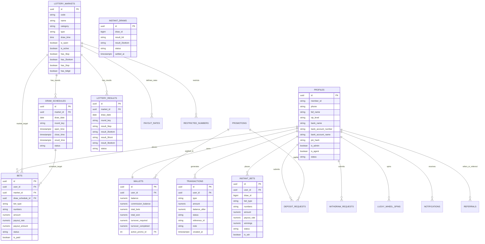
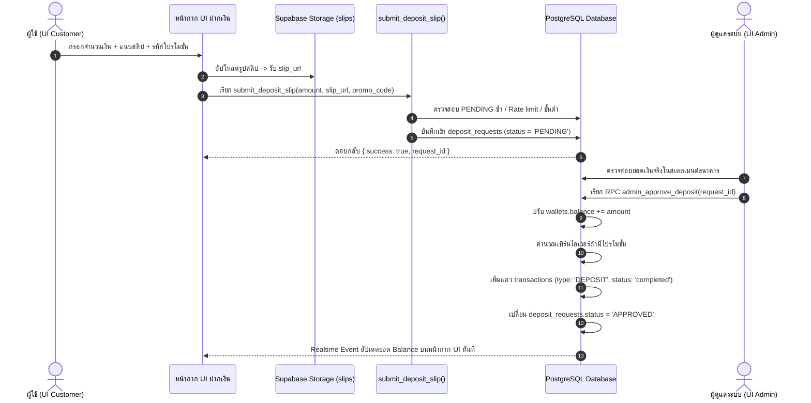
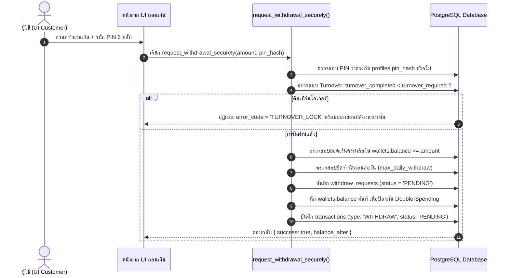
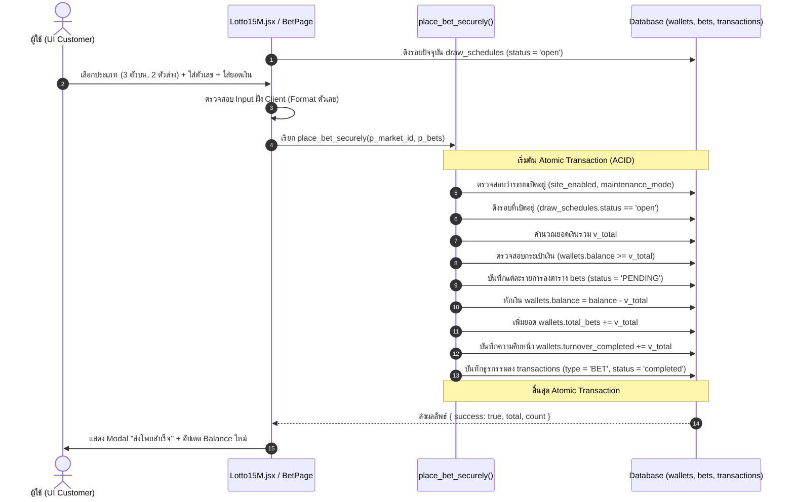
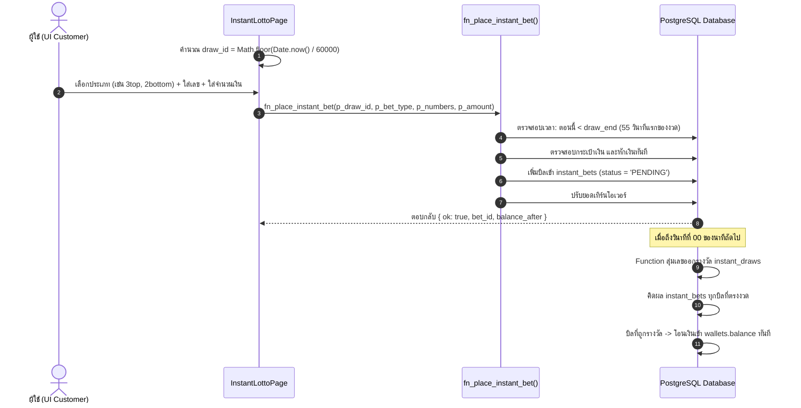
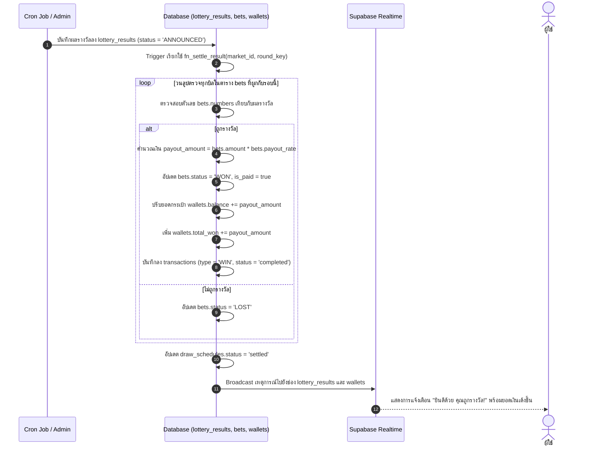

# THLOTTO-II: สถาปัตยกรรมข้อมูลจริง ผังความสัมพันธ์ระบบ และคู่มือเชื่อมต่อ UI (Live Database Blueprint & UI Integration Spec)

> **มาตรฐานการจัดทำ:** เอกสารนี้ถูกสกัดและสังเคราะห์โดยตรงจาก **Live Supabase Database (PostgreSQL)** ของระบบ THLOTTO-II ตามข้อกำหนดวิศวกรรม **ARM AI Engineering Standard (ARM-AES v1.0)** เพื่อให้ทีมพัฒนา Frontend สามารถนำหน้ากาก UI (UI Presentation Layer) มาสวมเข้ากับฐานข้อมูลและฟังก์ชันการทำงานจริงได้อย่างแม่นยำ 100%

---

## สารบัญ (Table of Contents)
1. [ภาพรวมสถาปัตยกรรมแบบ UI Facade (The Presentation Mask)](#1-ภาพรวมสถาปัตยกรรมแบบ-ui-facade-the-presentation-mask)
2. [ผังความสัมพันธ์เอนทิตีระบบ (Comprehensive Entity-Relationship Diagram: ERD)](#2-ผังความสัมพันธ์เอนทิตีระบบ-comprehensive-entity-relationship-diagram-erd)
3. [พจนานุกรมข้อมูลและโครงสร้างตารางจริง (Live Database Data Dictionary)](#3-พจนานุกรมข้อมูลและโครงสร้างตารางจริง-live-database-data-dictionary)
4. [วงจรชีวิตการทำงานและความสัมพันธ์ของข้อมูล (System Data Flows & Lifecycles)](#4-วงจรชีวิตการทำงานและความสัมพันธ์ของข้อมูล-system-data-flows--lifecycles)
   - 4.1 [วงจรการเงิน: การฝากเงิน (Deposit Lifecycle)](#41-วงจรการเงิน-การฝากเงิน-deposit-lifecycle)
   - 4.2 [วงจรการเงิน: การถอนเงินและการล็อกเทิร์น (Withdrawal & Turnover Lock Lifecycle)](#42-วงจรการเงิน-การถอนเงินและการล็อกเทิร์น-withdrawal--turnover-lock-lifecycle)
   - 4.3 [วงจรการแทงหวยรอบปกติและ 15 นาที (Standard & 15M Lotto Betting Flow)](#43-วงจรการแทงหวยรอบปกติและ-15-นาที-standard--15m-lotto-betting-flow)
   - 4.4 [วงจรการแทงหวยสปีด/ทันใจ 1 นาที (Instant Lotto Betting Flow)](#44-วงจรการแทงหวยสปีดทันใจ-1-นาที-instant-lotto-betting-flow)
   - 4.5 [วงจรการออกผลรางวัลและการคิดผลอัตโนมัติ (Draw Settlement & Payout Engine)](#45-วงจรการออกผลรางวัลและการคิดผลอัตโนมัติ-draw-settlement--payout-engine)
   - 4.6 [วงจรมินิเกมวงล้อลุ้นโชค (Lucky Wheel Gamification Flow)](#46-วงจรมินิเกมวงล้อลุ้นโชค-lucky-wheel-gamification-flow)
5. [สารบัญสัญญาสัญญาณฟังก์ชันฝั่งไคลเอนต์ (Client-Callable RPC API Contracts)](#5-สารบัญสัญญาสัญญาณฟังก์ชันฝั่งไคลเอนต์-client-callable-rpc-api-contracts)
6. [การเชื่อมต่อข้อมูลแบบเรียลไทม์ (Supabase Realtime Channels Matrix)](#6-การเชื่อมต่อข้อมูลแบบเรียลไทม์-supabase-realtime-channels-matrix)
7. [คู่มือการนำ UI หน้ากากมาสวมเข้ากับระบบจริง (UI-to-DB Integration Guide)](#7-คู่มือการนำ-ui-หน้ากากมาสวมเข้ากับระบบจริง-ui-to-db-integration-guide)

---

## 1. ภาพรวมสถาปัตยกรรมแบบ UI Facade (The Presentation Mask)

ระบบ THLOTTO-II ได้รับการออกแบบตามหลัก **Decoupled Architecture**:
- **UI Customer Layer (`UI Customer/src/`):** ทำหน้าที่เสมือน **"หน้ากาก (Presentation Shell/Facade)"** ดูแลเรื่อง UX/UI, การจัดเลย์เอาต์ (Container Queries), อนิเมชัน, และการเก็บรวบรวม Input จากผู้ใช้ โดยไม่คำนวณการเงินหรือผลลัพธ์เกมเองที่ฝั่ง Client
- **Supabase BaaS Layer (PostgreSQL + RLS + GoTrue Auth + Realtime Engine):** ควบคุม State ทั้งหมดของการเล่นเกม ความปลอดภัย การคิดเงิน และการหักบัญชีผ่าน Stored Procedures (RPC) ที่ทำงานเป็น Atomic Database Transactions ป้องกัน Race Condition และการปลอมแปลงข้อมูล (Tamper-proof)

```
┌────────────────────────────────────────────────────────────────────────┐
│                   UI CUSTOMER (React 19 + Tailwind)                    │
│  [Lotto15M.jsx]   [LottoRulesModal]   [BetPanel]   [WalletCard]        │
└──────────────┬──────────────────┬───────────────────┬──────────────────┘
               │                  │                   │
      Supabase Auth          RPC Functions      Realtime WS
      (JWT / Session)     (Atomic Transactions) (Postgres Changes)
               │                  │                   │
┌──────────────▼──────────────────▼───────────────────▼──────────────────┐
│                      SUPABASE POSTGRESQL ENGINE                        │
│                                                                        │
│   [profiles] ─────── [wallets] ─────── [transactions]                  │
│       │                 │                                              │
│       │                 ▼                                              │
│       │          [bets] / [instant_bets]                               │
│       │                 ▲                                              │
│   [deposit_req]         │                                              │
│   [withdraw_req]   [draw_schedules] ─── [lottery_markets]              │
│   [lucky_wheel]         │                       │                      │
│                         ▼                       ▼                      │
│                 [lottery_results]        [payout_rates]                │
└────────────────────────────────────────────────────────────────────────┘
```

---

## 2. ผังความสัมพันธ์เอนทิตีระบบ (Comprehensive Entity-Relationship Diagram: ERD)



---

## 3. พจนานุกรมข้อมูลและโครงสร้างตารางจริง (Live Database Data Dictionary)

### 3.1 กลุ่มผู้ใช้และการเงิน (Identity & Financial Entities)

#### ตาราง `profiles` (ข้อมูลบัญชีสมาชิก)
ตารางหลักที่ซิงก์กับ `auth.users` ของ Supabase
| Column Name | Data Type | Nullable | Default | คำอธิบายทางธุรกิจ |
|---|---|---|---|---|
| `id` | `uuid` | NO | (FK auth.users) | Primary Key ตรงกับ `auth.uid()` |
| `member_id` | `text` | YES | null | รหัสสมาชิก เช่น `TH888999` |
| `full_name` | `text` | YES | null | ชื่อ-นามสกุลจริง |
| `phone` | `text` | YES | null | เบอร์โทรศัพท์ที่ใช้ล็อกอิน |
| `vip_level` | `text` | YES | `'MEMBER'` | ระดับสมาชิก (`MEMBER`, `VIP`, `PLATINUM`) |
| `bank_name` | `text` | YES | null | ชื่อย่อธนาคาร (เช่น `KBANK`, `SCB`, `KTB`) |
| `bank_account_number` | `text` | YES | null | เลขบัญชีธนาคารสำหรับถอนเงิน |
| `bank_account_name` | `text` | YES | null | ชื่อเจ้าของบัญชี (ต้องตรงกับชื่อสมาชิก) |
| `pin_hash` | `text` | YES | null | รหัส PIN 6 หลักเข้ารหัส สำหรับอนุมัติการถอนเงิน |
| `avatar_url` | `text` | YES | null | ลิงก์รูปประจำตัว |
| `is_admin` | `boolean` | NO | `false` | สิทธิ์ผู้ดูแลระบบ |
| `is_agent` | `boolean` | YES | `false` | สิทธิ์ตัวแทนจำหน่าย |
| `status` | `text` | NO | `'active'` | สถานะบัญชี (`active`, `suspended`, `banned`) |
| `referrer_id` | `uuid` | YES | null | รหัส `profiles.id` ของผู้ที่แนะนำมา |
| `created_at` | `timestamptz` | YES | `now()` | วันที่สมัคร |

#### ตาราง `wallets` (กระเป๋าเงินและเทิร์นโอเวอร์)
สร้างอัตโนมัติทันทีที่สมาชิกสมัครผ่าน Trigger `trg_fn_create_wallet`
| Column Name | Data Type | Nullable | Default | คำอธิบายทางธุรกิจ |
|---|---|---|---|---|
| `id` | `uuid` | NO | `uuid_generate_v4()` | PK กระเป๋าเงิน |
| `user_id` | `uuid` | NO | (FK profiles.id) | รหัสสมาชิกเจ้าของกระเป๋า |
| `balance` | `numeric` | YES | `0.00` | ยอดเงินคงเหลือที่ใช้แทงหรือถอนได้ (บาท) |
| `commission_balance` | `numeric` | YES | `0.00` | ยอดค่าคอมมิชชันสะสมจากการแนะนำเพื่อน |
| `total_bets` | `numeric` | YES | `0.00` | ยอดเดิมพันสะสมตลอดชีพ |
| `total_won` | `numeric` | YES | `0.00` | ยอดเงินรางวัลที่ได้รับสะสมตลอดชีพ |
| `active_promo_id` | `integer` | YES | null | รหัสโปรโมชั่นที่กำลังเปิดใช้งานอยู่ |
| `turnover_required` | `numeric` | YES | `0` | ยอดเทิร์นโอเวอร์รวมที่ต้องทำให้ครบก่อนถอนได้ |
| `turnover_completed` | `numeric` | YES | `0` | ยอดเทิร์นโอเวอร์ที่ทำสำเร็จแล้วในปัจจุบัน |
| `promo_max_withdrawal` | `numeric` | YES | `0` | วงเงินถอนสูงสุดตามเงื่อนไขโปรโมชั่น (0 = ไม่จำกัด) |
| `promo_allowed_game` | `text` | YES | `'all'` | เกมที่อนุญาตให้นับเทิร์น (`all`, `main`, `instant`) |

#### ตาราง `transactions` (สมุดบันทึกประวัติการเงิน Ledger)
บันทึกแบบ Immutable History ห้ามแก้ไขย้อนหลัง
| Column Name | Data Type | Nullable | Default | คำอธิบายทางธุรกิจ |
|---|---|---|---|---|
| `id` | `uuid` | NO | `uuid_generate_v4()` | PK ธุรกรรม |
| `user_id` | `uuid` | YES | (FK profiles.id) | รหัสผู้ทำธุรกรรม |
| `type` | `text` | NO | - | ประเภทธุรกรรม: `DEPOSIT`, `WITHDRAW`, `BET`, `WIN`, `COMMISSION`, `WHEEL_SPIN` |
| `amount` | `numeric` | NO | - | จำนวนเงินของรายการ |
| `balance_after` | `numeric` | YES | `0` | ยอดเงินคงเหลือในกระเป๋าทันทีหลังจากทำรายการนี้ |
| `status` | `text` | YES | `'PENDING'` | สถานะ: `PENDING`, `completed`, `REJECTED`, `CANCELLED` |
| `reference_id` | `text` | YES | null | อ้างอิง ID คำขอ (เช่น `deposit_requests.id`, `bets.id`) |
| `note` | `text` | YES | null | รายละเอียดบันทึก (เช่น "แทงหวย 15 นาที", "อนุมัติฝากเงิน") |
| `created_at` | `timestamptz` | YES | `now()` | เวลาที่ทำรายการ |

---

### 3.2 กลุ่มตลาดหวยและการออกรางวัล (Lottery Engine Entities)

#### ตาราง `lottery_markets` (รายการตลาดหวยทั้งหมด 37 ตลาด)
| Column Name | Data Type | Nullable | Default | คำอธิบายทางธุรกิจ |
|---|---|---|---|---|
| `id` | `uuid` | NO | `uuid_generate_v4()` | PK ตลาดหวย (เช่น `2ecc136e...` สำหรับ 15 นาที) |
| `code` | `text` | YES | - | รหัสอ้างอิง: `THLOTTO_15M`, `TH_GOV`, `HANOI`, `LAO`, `MK_TODAY` |
| `name` | `text` | NO | - | ชื่อที่แสดงบน UI เช่น `ล็อตโต้ 15 นาที`, `หวยรัฐบาล` |
| `category` | `text` | YES | - | หมวดหมู่: `SPEED`, `GOV`, `FOREIGN`, `MAEKHONG`, `STOCK` |
| `type` | `text` | NO | - | หมวดชนิดเกม: `lottery`, `GOVERNMENT`, `HANOI`, `MALAY`, `STOCK` |
| `draw_time` | `time` | YES | - | เวลาออกรางวัลปกติ |
| `close_minutes_before` | `integer` | YES | `20` | จำนวนนาทีก่อนออกผลที่ต้องปิดรับแทง |
| `is_open` | `boolean` | YES | `true` | สถานะเปิดให้แทงในภาพรวม |
| `is_active` | `boolean` | YES | `true` | สถานะเปิดใช้งานในระบบ |
| `has_3top` | `boolean` | YES | `true` | เปิดรับแทง 3 ตัวบน หรือไม่ |
| `has_2bottom` | `boolean` | YES | `true` | เปิดรับแทง 2 ตัวล่าง หรือไม่ |
| `has_2top` | `boolean` | YES | `false` | เปิดรับแทง 2 ตัวบน หรือไม่ |
| `has_3bottom` | `boolean` | YES | `false` | เปิดรับแทง 3 ตัวล่าง หรือไม่ |
| `has_6digit` | `boolean` | YES | `false` | มีรางวัล 6 ตัวตรงหรือไม่ (เช่น หวยรัฐบาล) |
| `logo_url` | `text` | YES | null | URL โลโก้ของตลาด |
| `stream_url` | `text` | YES | `''` | ลิงก์ไลฟ์สตรีมสดผลหวย (ถ้ามี) |

#### ตาราง `draw_schedules` (รอบการออกรางวัลและการเปิด-ปิดรับ)
| Column Name | Data Type | Nullable | Default | คำอธิบายทางธุรกิจ |
|---|---|---|---|---|
| `id` | `uuid` | NO | `uuid_generate_v4()` | PK รอบหวย |
| `market_id` | `uuid` | NO | (FK lottery_markets) | ตลาดหวยที่ผูก |
| `draw_date` | `date` | NO | - | วันที่ออกรางวัล (YYYY-MM-DD) |
| `round_key` | `text` | YES | `''` | คีย์ประจำรอบ (เช่น `2026-09-07_01`, `TH_GOV_2026-09-16`) |
| `open_time` | `timestamptz` | NO | - | เวลาเปิดรับแทง |
| `close_time` | `timestamptz` | NO | - | เวลาปิดรับแทงรอบนี้ |
| `result_time` | `timestamptz` | NO | - | เวลาที่ผลรางวัลออก |
| `status` | `text` | NO | `'open'` | สถานะรอบ: `'open'`, `'closed'`, `'settled'`, `'cancelled'` |

#### ตาราง `payout_rates` (อัตราจ่ายตามตลาดและประเภทการแทง)
| Column Name | Data Type | Nullable | Default | คำอธิบาย |
|---|---|---|---|---|
| `id` | `uuid` | NO | `uuid_generate_v4()` | PK อัตราจ่าย |
| `market` | `text` | NO | - | รหัสตลาด (เช่น `THLOTTO_15M`, `TH_GOV`, `HANOI`) |
| `bet_type` | `text` | NO | - | ชนิดการแทง: `3TOP`, `3TODE`, `2TOP`, `2BOTTOM`, `RUN_UP`, `RUN_DOWN` |
| `rate` | `numeric` | NO | - | อัตราจ่ายบาทละ (เช่น 900.00, 95.00, 3.20) |

#### ตาราง `bets` (บิลเดิมพันหวยปกติ & ล็อตโต้ 15 นาที)
| Column Name | Data Type | Nullable | Default | คำอธิบาย |
|---|---|---|---|---|
| `id` | `uuid` | NO | `uuid_generate_v4()` | PK บิลแทง |
| `user_id` | `uuid` | YES | (FK profiles) | สมาชิกผู้แทง |
| `market_id` | `uuid` | YES | (FK lottery_markets) | ตลาดที่แทง |
| `draw_schedule_id` | `uuid` | YES | (FK draw_schedules) | รอบการแทงที่ผูก |
| `bet_type` | `text` | NO | - | ประเภทแทง (เช่น `3TOP`, `2BOTTOM`) |
| `numbers` | `text` | NO | - | ตัวเลขที่แทง (เช่น `'123'`, `'45'`) |
| `amount` | `numeric` | NO | - | ยอดเงินเดิมพัน (บาท) |
| `payout_rate` | `numeric` | YES | - | อัตราจ่ายที่ล็อกไว้ ณ เวลาแทง |
| `status` | `text` | YES | `'PENDING'` | สถานะบิล: `'PENDING'`, `'WON'`, `'LOST'`, `'CANCELLED'` |
| `payout_amount` | `numeric` | YES | `0.00` | ยอดเงินรางวัลที่ได้รับจริง (กรณีถูกรางวัล) |
| `is_paid` | `boolean` | YES | `false` | จ่ายเงินรางวัลเข้ากระเป๋าแล้วหรือยัง |
| `created_at` | `timestamptz` | YES | `now()` | เวลาที่ส่งโพย |

#### ตาราง `lottery_results` (ตารางผลรางวัลหวย)
| Column Name | Data Type | Nullable | Default | คำอธิบาย |
|---|---|---|---|---|
| `id` | `uuid` | NO | `uuid_generate_v4()` | PK ผลรางวัล |
| `market_id` | `uuid` | YES | (FK lottery_markets) | รหัสตลาด |
| `draw_date` | `date` | NO | - | วันที่ออกผล |
| `round_key` | `text` | YES | `''` | คีย์รอบที่ตรงกับ `draw_schedules.round_key` |
| `result_3top` | `text` | YES | null | เลข 3 ตัวบน (เช่น `'529'`) |
| `result_2bottom` | `text` | YES | null | เลข 2 ตัวล่าง (เช่น `'14'`) |
| `result_3front` | `text` | YES | null | เลข 3 ตัวหน้า (หวยรัฐบาล) |
| `result_3bottom` | `text` | YES | null | เลข 3 ตัวล่าง (หวยรัฐบาล) |
| `result_2top` | `text` | YES | null | เลข 2 ตัวบน |
| `result_main` | `text` | YES | null | เลขรางวัลที่ 1 เต็มจำนวน (เช่น 6 ตัว) |
| `status` | `text` | YES | `'PENDING'` | สถานะ: `'PENDING'`, `'ANNOUNCED'`, `'SETTLED'` |
| `announced_at` | `timestamptz` | YES | null | เวลาที่ประกาศผล |

---

### 3.3 กลุ่มหวยทันใจสปีด 1 นาที (Instant Lottery Entities)

#### ตาราง `instant_bet_types` (กติกาและอัตราจ่ายหวย 1 นาที)
| Code | Name | Rate | Min/Max Digits | Is Positioned | คำอธิบาย |
|---|---|---|---|---|---|
| `2top` | 2 ตัวบน | 90 | 2 / 2 | false | อิง 2 ตัวท้ายผลรางวัล |
| `2bottom` | 2 ตัวล่าง | 90 | 2 / 2 | false | อิงเลข 2 ตัวล่าง |
| `3top` | 3 ตัวบน | 900 | 3 / 3 | false | อิง 3 ตัวท้ายผลรางวัล |
| `3toad` | 3 ตัวโต๊ด | 180 | 3 / 3 | false | สลับตำแหน่ง 3 ตัวบน |
| `3front` | 3 ตัวหน้า | 900 | 3 / 3 | false | อิง 3 ตัวแรกผลรางวัล |
| `3back` | 3 ตัวท้าย | 900 | 3 / 3 | false | อิง 3 ตัวท้ายผลรางวัล |
| `6straight`| 6 ตัวตรง | 15000 | 6 / 6 | false | ถูกครบทั้ง 6 หลักตรงตำแหน่ง |
| `pin_top` | ปักหลักบน | 9.9 | 0 / 0 | true | ปักหลักร้อย/สิบ/หน่วย |
| `pin_bottom`| ปักหลักล่าง| 9.9 | 0 / 0 | true | ปักหลักสิบ/หน่วยล่าง |

#### ตาราง `instant_draws` (งวดผลสปีด 1 นาที)
| Column | Type | Default | รายละเอียด |
|---|---|---|---|
| `draw_id` | `bigint` | - | รหัสงวดคำนวณจาก Unix Timestamp รายนาที (`Math.floor(Date.now() / 60000)`) |
| `result_6d` | `text` | - | ผลตัวเลขสุ่ม 6 ตัวตรง เช่น `'948512'` |
| `result_2bottom` | `text` | - | ผลเลข 2 ตัวล่าง เช่น `'47'` |
| `status` | `text` | `'PENDING'` | สถานะการคิดผลรางวัล |

#### ตาราง `instant_bets` (บิลเดิมพันหวย 1 นาที)
บันทึกการแทงของสมาชิกในแต่ละงวด `draw_id` พร้อมคำนวณเทิร์นโอเวอร์ทันที

---

### 3.4 กลุ่มระบบสนับสนุนการเงิน มินิเกม และระบบแนะนำเพื่อน

#### ตาราง `deposit_requests` (คำขอฝากเงิน)
- `user_id`: รหัสผู้ฝาก
- `amount`: จำนวนเงินฝาก (ต้องไม่ต่ำกว่า `settings.min_deposit` ปกติ 100 บาท)
- `slip_url`: URL รูปภาพสลิปธนาคาร (อัปโหลดไว้ใน Supabase Storage Bucket `slips`)
- `promo_code`: โค้ดโปรโมชั่นที่เลือกรับ (ถ้ามี)
- `status`: `'PENDING'`, `'APPROVED'`, `'REJECTED'`
- **Business Rule:** หากมีสถานะ `PENDING` ค้างอยู่ ผู้ใช้จะไม่สามารถกดส่งคำขอใหม่ซ้ำได้ และมีคูลดาวน์ตาม `deposit_timeout_seconds`

#### ตาราง `withdraw_requests` (คำขอถอนเงิน)
- `user_id`: ผู้ขอถอน
- `amount`: จำนวนเงินที่ต้องการถอน (300 - 50,000 บาท/ครั้ง, สูงสุด 100,000 บาท/วัน, ไม่เกิน 5 ครั้ง/วัน)
- `status`: `'PENDING'`, `'APPROVED'`, `'REJECTED'`
- **Business Rule:** ต้องผ่านการตรวจสอบ PIN (`pin_hash`), ต้องไม่ติดเงื่อนไขเทิร์นโอเวอร์คงค้าง (`turnover_required <= turnover_completed`)

#### ตาราง `lucky_wheel_prizes` & `lucky_wheel_spins` (วงล้อนำโชค)
- วงล้อมี 8 ช่อง (`slot_index` 0 - 7)
- หมุนได้วันละ 5 ครั้ง (`settings.lucky_wheel_daily_limit`)
- ค่าหมุนครั้งละ 10 บาท (`settings.lucky_wheel_cost`)
- รางวัลมีทั้งเครดิตเงินสดและแต้มสะสม

---

## 4. วงจรชีวิตการทำงานและความสัมพันธ์ของข้อมูล (System Data Flows & Lifecycles)

### 4.1 วงจรการเงิน: การฝากเงิน (Deposit Lifecycle)



---

### 4.2 วงจรการเงิน: การถอนเงินและการล็อกเทิร์น (Withdrawal & Turnover Lock Lifecycle)



---

### 4.3 วงจรการแทงหวยรอบปกติและ 15 นาที (Standard & 15M Lotto Betting Flow)

ใช้สำหรับตลาดหวยที่มีรอบตามเวลา เช่น **หวยรัฐบาล**, **หวยฮานอย**, **หวยลาว**, และ **ล็อตโต้ 15 นาที (`THLOTTO_15M`)**



---

### 4.4 วงจรการแทงหวยสปีด/ทันใจ 1 นาที (Instant Lotto Betting Flow)



---

### 4.5 วงจรการออกผลรางวัลและการคิดผลอัตโนมัติ (Draw Settlement & Payout Engine)



---

### 4.6 วงจรมินิเกมวงล้อลุ้นโชค (Lucky Wheel Gamification Flow)

1. หน้า UI เรียกฟังก์ชัน `get_spin_status()`:
   - ตรวจสอบว่าผู้ใช้ล็อกอินอยู่หรือไม่
   - ดึงรายการรางวัล 8 ช่องจาก `lucky_wheel_prizes`
   - คำนวณจำนวนครั้งที่หมุนไปแล้วในวันนี้ (`spins_used`) เทียบกับโควตา (`daily_limit` = 5)
   - ส่งข้อมูลช่องสี, ข้อความรางวัล, และค่าหมุน (`spin_cost` = 10 บาท) ให้หน้ากาก UI
2. ผู้ใช้กดปุ่ม **"หมุนวงล้อ"**:
   - UI เรียกฟังก์ชัน RPC `spin_lucky_wheel()`
   - เซิร์ฟเวอร์ตรวจสอบยอดเงินในกระเป๋า (`balance >= 10`)
   - เซิร์ฟเวอร์คำนวณการสุ่มผลลัพธ์ตามค่าน้ำหนักโอกาส (`probability`)
   - หักเงิน 10 บาทจาก `wallets.balance`
   - หากได้รับรางวัลเงินสด ระบบจะโอนเงินรางวัลกลับเข้า `wallets.balance` ทันที และบันทึก `transactions`
   - เซิร์ฟเวอร์ส่งหมายเลขช่องที่ออก (`slot_index` 0-7) กลับมาให้ UI หมุนอนิเมชันให้ตรงช่องเป้าหมาย

---

## 5. สารบัญสัญญาสัญญาณฟังก์ชันฝั่งไคลเอนต์ (Client-Callable RPC API Contracts)

ตารางสรุปฟังก์ชัน Stored Procedures ทั้งหมดที่ฝั่งไคลเอนต์สามารถเรียกใช้ผ่าน `supabase.rpc(...)`:

| Function Name | Arguments | Output Type | สิทธิ์การเข้าถึง | วัตถุประสงค์การใช้งาน |
|---|---|---|---|---|
| `place_bet_securely` | `p_market_id text`, `p_bets jsonb`, `p_schedule_id uuid (optional)` | `jsonb` | Authenticated | ส่งโพยแทงหวยรอบปกติและ 15 นาที |
| `fn_place_instant_bet` | `p_draw_id bigint`, `p_bet_type text`, `p_numbers text`, `p_amount numeric` | `jsonb` | Authenticated | ส่งบิลแทงหวยสปีด 1 นาที |
| `submit_deposit_slip` | `p_amount numeric`, `p_slip_url text`, `p_promo_code text (optional)` | `jsonb` | Authenticated | ส่งคำขอฝากเงินพร้อมแนบรูปสลิป |
| `request_withdrawal_securely`| `p_amount numeric`, `p_pin_hash text` | `jsonb` | Authenticated | ส่งคำขอถอนเงินเข้าบัญชีธนาคาร |
| `get_markets_with_countdown`| *(none)* | `TABLE` | Public / Auth | ดึงรายการตลาดพร้อมเวลานับถอยหลัง |
| `get_today_results` | *(none)* | `TABLE` | Public / Auth | ดึงผลรางวัลหวยทุกตลาดประจำวันนี้ |
| `get_spin_status` | *(none)* | `jsonb` | Authenticated | ดึงสถานะสิทธิ์และรายการรางวัลวงล้อ |
| `spin_lucky_wheel` | *(none)* | `jsonb` | Authenticated | ดำเนินการหมุนวงล้อเสี่ยงโชค |
| `get_user_stats` | *(none)* | `jsonb` | Authenticated | ดึงสถิติภาพรวมของผู้ใช้ (ยอดเล่น/ยอดถูก) |
| `user_get_referral_stats` | `user_id uuid` | `jsonb` | Authenticated | ดึงสถิติรายได้และสมาชิกที่แนะนำ |
| `user_get_my_referrals` | `user_id uuid` | `TABLE` | Authenticated | ดึงรายชื่อสมาชิกใต้สายงาน |
| `transfer_referral_income` | *(none)* | `jsonb` | Authenticated | โอนยอดคอมมิชชันเข้ากระเป๋าหลัก |
| `apply_promotion` | `p_user_id uuid`, `p_promo_code text`, `p_deposit_amount numeric` | `jsonb` | Authenticated | กดรับโปรโมชั่น |

---

### โค้ดตัวอย่างการเรียกใช้จริงจากฝั่ง JavaScript / React

#### 1. การส่งโพยแทงหวย (`place_bet_securely`)
```javascript
import { supabase } from '../supabaseClient';

export async function submitBetSlip(marketId, betList) {
  // betList ต้องอยู่ในรูปแบบ Array of Objects:
  // [{ bet_type: '3TOP', numbers: '852', amount: 100, payout_rate: 900 }]
  const { data, error } = await supabase.rpc('place_bet_securely', {
    p_market_id: marketId,
    p_bets: betList
  });

  if (error) {
    throw new Error(error.message);
  }
  
  if (!data.success) {
    throw new Error(data.message); // เช่น "ยอดเงินไม่พอ" หรือ "ยังไม่เปิดรับแทง"
  }

  return data; // { success: true, total: 100, count: 1 }
}
```

#### 2. การถอนเงินแบบปลอดภัย (`request_withdrawal_securely`)
```javascript
export async function requestWithdraw(amount, pinCode) {
  const { data, error } = await supabase.rpc('request_withdrawal_securely', {
    p_amount: Number(amount),
    p_pin_hash: pinCode // PIN 6 หลักที่ผู้ใช้กรอก
  });

  if (error) throw new Error(error.message);
  if (!data.success) {
    if (data.error_code === 'TURNOVER_LOCK') {
      throw new Error(`ติดเทิร์นโอเวอร์: กรุณาแทงเพิ่มอีก ฿${data.turnover_required - data.turnover_completed}`);
    }
    throw new Error(data.message);
  }

  return data; // { success: true, balance_after: ... }
}
```

#### 3. การหมุนวงล้อสุ่มรางวัล (`spin_lucky_wheel`)
```javascript
export async function spinWheel() {
  const { data, error } = await supabase.rpc('spin_lucky_wheel');
  if (error) throw new Error(error.message);
  if (!data.success) throw new Error(data.message);

  // data = { success: true, slot_index: 3, prize: 'เครดิต 50 บาท', amount: 50, spins_left: 2 }
  return data;
}
```

---

## 6. การเชื่อมต่อข้อมูลแบบเรียลไทม์ (Supabase Realtime Channels Matrix)

เพื่อให้หน้ากาก UI อัปเดตข้อมูลอัตโนมัติโดยไม่ต้องกด Refresh ให้ใช้ Supabase Realtime Channel ดังนี้:

| Entity | Channel Name | Filter | เหตุการณ์ (Event) | ผลต่อหน้า UI |
|---|---|---|---|---|
| **ยอดเงินคงเหลือ** | `user_wallet` | `user_id=eq.${user.id}` | `UPDATE` บน `wallets` | อัปเดตตัวเลข Balance ใน Header และแถบกระเป๋าเงินทันที |
| **รอบเวลาหวย** | `market_schedules` | `market_id=eq.${marketId}` | `UPDATE` บน `draw_schedules` | เปลี่ยนสถานะปุ่มแทงจาก "เปิดรับ" เป็น "ปิดรับ" หรือสลับรอบ |
| **ผลรางวัลล่าสุด**| `latest_results` | `market_id=eq.${marketId}` | `INSERT` / `UPDATE` บน `lottery_results` | แสดงตัวเลขผลรางวัลที่ออกบนหน้า Studio ทันที |
| **การแจ้งเตือน** | `user_notifs` | `user_id=eq.${user.id}` | `INSERT` บน `notifications` | แสดง Pop-up แจ้งเตือนเมื่อเงินเข้าหรือถูกรางวัล |

### ตัวอย่าง React Hook สำหรับ Realtime Wallet Balance
```javascript
import { useEffect, useState } from 'react';
import { supabase } from '../supabaseClient';
import { useAuth } from '../AuthContext';

export function useRealtimeWallet() {
  const { user } = useAuth();
  const [wallet, setWallet] = useState(null);

  useEffect(() => {
    if (!user) return;

    // 1. ดึงข้อมูลครั้งแรก
    supabase
      .from('wallets')
      .select('*')
      .eq('user_id', user.id)
      .single()
      .then(({ data }) => setWallet(data));

    // 2. ซับสไครบ์การเปลี่ยนแปลงแบบเรียลไทม์
    const channel = supabase
      .channel(`wallet:${user.id}`)
      .on(
        'postgres_changes',
        { event: 'UPDATE', schema: 'public', table: 'wallets', filter: `user_id=eq.${user.id}` },
        (payload) => {
          setWallet(payload.new);
        }
      )
      .subscribe();

    return () => {
      supabase.removeChannel(channel);
    };
  }, [user]);

  return wallet;
}
```

---

## 7. คู่มือการนำ UI หน้ากากมาสวมเข้ากับระบบจริง (UI-to-DB Integration Guide)

### 7.1 การปรับหน้า `Lotto15M.jsx` และส่วนประกอบหวย 15 นาที
ในโค้ดเดิมของ [Lotto15M.jsx](file:///c:/Users/armyn/Downloads/THLOTTO-II/UI%20Customer/src/pages/Lotto15M.jsx):
1. **Market ID จริง:** มีค่าคงที่คือ `2ecc136e-0734-4be0-9e26-cf3149cb84cd` (ซึ่งตรงกับตาราง `lottery_markets` ในฐานข้อมูลจริง)
2. **การดึงอัตราจ่ายจริง (Payout Rates):** ไม่ควรใช้ Hardcoded Array ในไฟล์ ให้ดึงจากตาราง `payout_rates` แบบ Dynamic:
   ```javascript
   const { data: rates } = await supabase
     .from('payout_rates')
     .select('bet_type, rate')
     .eq('market', 'THLOTTO_15M');
   ```
3. **การดึงรอบปัจจุบัน (Current Draw Schedule):**
   ```javascript
   const { data: currentSchedule } = await supabase
     .from('draw_schedules')
     .select('*')
     .eq('market_id', '2ecc136e-0734-4be0-9e26-cf3149cb84cd')
     .eq('status', 'open')
     .order('draw_date', { ascending: true })
     .limit(1)
     .single();
   ```
4. **การส่งโพยแทงจริง:** นำลิสต์ตัวเลขที่ผู้ใช้เลือกใน UI แปลงเป็น Payload แล้วส่งไปยัง `supabase.rpc('place_bet_securely', { p_market_id: marketId, p_bets: payload })`

### 7.2 กฎมาตรฐาน Web Standards ที่ต้องผูกกับ UI Components
- **โมดอลกติกา (`LottoRulesModal.jsx`):** ย้ายจากการใช้ `<div className="fixed inset-0...">` มาใช้ Native HTML `<dialog>` element พร้อมเมธอด `.showModal()` และ `.close()` ตามกฎวิศวกรรมสากล
- **แท็บสลับประเภทหวย:** ใช้ CSS Anchor Positioning หรือ Sliding Highlight Tracker เพื่อให้มีตัวระบุแท็บที่เคลื่อนที่ได้อย่างนุ่มนวล
- **การ์ดแสดงสถิติและผลย้อนหลัง:** ใช้ CSS Container Queries (`@container (min-width: ...)` ) เพื่อให้การ์ดปรับรูปแบบอัตโนมัติตามความกว้างของคอลัมน์ ไม่ผูกกับขนาดหน้าจอใหญ่ (Viewport)

---
*เอกสารฉบับนี้พร้อมนำไปใช้งานประกอบการสร้างและเชื่อมต่อ UI ทันที*
