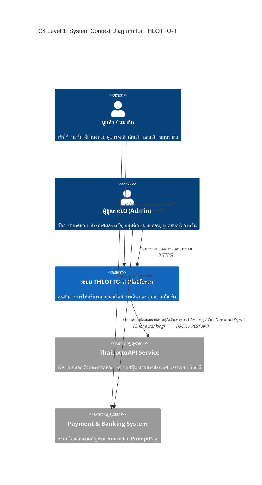
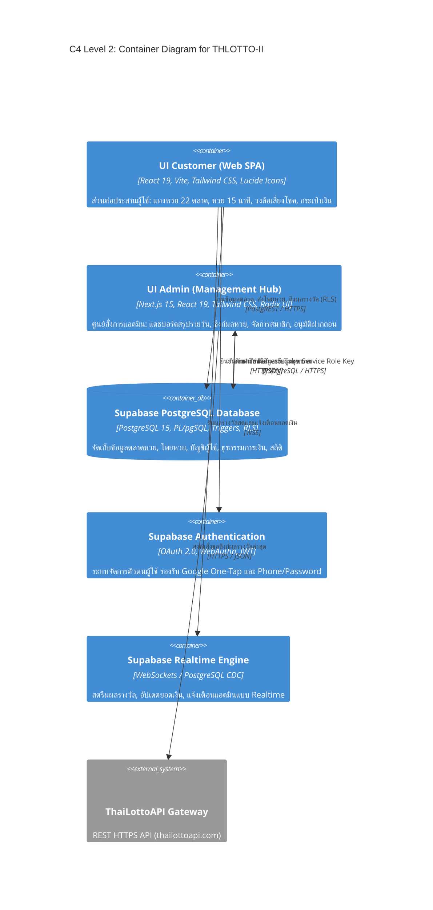
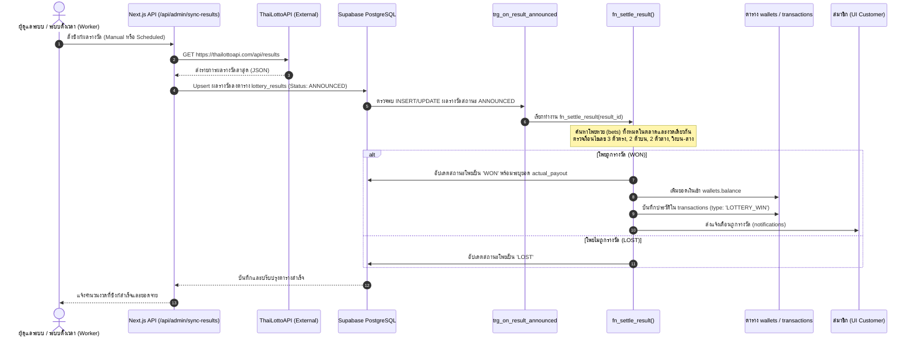
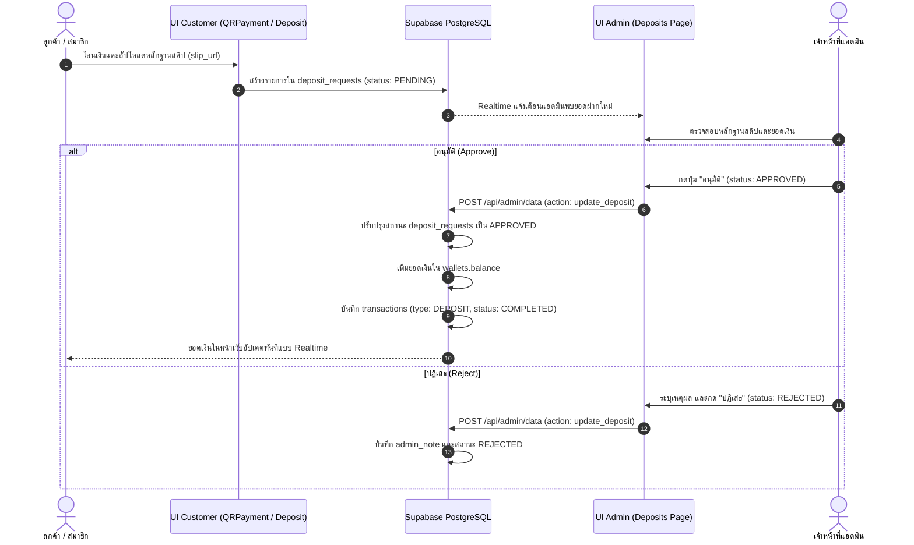

# พิมพ์เขียวสถาปัตยกรรมระบบ (Architecture Blueprint)
**โครงการ:** THLOTTO-II (Next-Gen Lottery & Gaming Platform)  
**มาตรฐานกำกับ:** ARM AI Engineering Standard (ARM-AES v1.0)  
**เวอร์ชันเอกสาร:** 1.0.0 (Production Release Blueprint)  
**สถานะ:** สมบูรณ์ 100% พร้อมใช้งานจริง  

---

## 1. บทสรุปผู้บริหารและวิสัยทัศน์ทางสถาปัตยกรรม (Executive Overview)

THLOTTO-II เป็นแพลตฟอร์มระบบหวยออนไลน์และการเดิมพันแบบครบวงจรระดับสากล สถาปัตยกรรมถูกออกแบบภายใต้หลักการ **Clean Architecture**, **Domain-Driven Design (DDD)**, และ **Security-by-Design** โดยแยกส่วนการทำงานระหว่าง:
1. **แผงควบคุมผู้ดูแลระบบ (UI Admin):** สร้างด้วย **Next.js 15 (App Router)** ให้ประสิทธิภาพระดับ SSR/Server Actions สำหรับงานประมวลผลและการบริหารจัดการ
2. **ระบบลูกค้าและผู้ใช้งาน (UI Customer):** สร้างด้วย **React 19 + Vite 6** ให้ความรวดเร็วระดับ Ultra-fast Single Page Application (SPA) เพื่อการเล่นเกมและการแทงหวยแบบไร้รอยต่อ
3. **โครงสร้างพื้นฐานข้อมูลและ Realtime Backend (Supabase BaaS):** ใช้ **PostgreSQL 15** ขับเคลื่อนด้วย Stored Procedures, PL/pgSQL Automated Triggers, และ Row Level Security (RLS) เพื่อให้การออกรางวัลและการคำนวณผลชนะเป็น **Atomic & Instantaneous Settlement**
4. **ผู้ให้บริการข้อมูลรางวัลภายนอก (ThaiLottoAPI Gateway):** เชื่อมโยงผลรางวัลหวยสดระดับชาติและนานาชาติมากกว่า 22 ชนิด (ทั้งหวยรัฐบาล, ออมสิน, ธ.ก.ส., ฮานอย, ลาว, มาเลย์, หุ้น และหวยความเร็วสูง 15 นาที) ผ่านระบบ Secure Automated Polling & Manual Triggering

---

## 2. C4 Architecture Models

### 2.1 C4 Level 1: บริบทระบบ (System Context Diagram)

---

### 2.2 C4 Level 2: สถาปัตยกรรมคอนเทนเนอร์ (Container Diagram)

---

### 2.3 C4 Level 3: สถาปัตยกรรมคอมโพเนนต์ภายใน UI Admin (Component Diagram)

UI Admin แบ่งออกเป็น 21 โมดูลหน้างาน โดยทุกโมดูลเชื่อมต่อฐานข้อมูลจริงผ่าน REST Gateway (`/api/admin/data` และ `/api/admin/sync-results`):

| โมดูลหน้างาน (Component) | หน้าที่หลัก (Core Responsibilities) | ฐานข้อมูลที่เกี่ยวข้อง |
| :--- | :--- | :--- |
| **Dashboard (`dashboard.tsx`)** | สรุปยอดเงินรวม (ฝาก, ถอน, กำไร-ขาดทุน), Top 10 ผู้เล่น, กราฟสถิติ 7 วัน | `deposit_requests`, `withdraw_requests`, `bets`, `profiles` |
| **Results Hub (`results.tsx`)** | ตรวจสอบผลรางวัล, กรอกผลด้วยมือ, ปุ่มกดซิงก์ ThaiLottoAPI แบบอัตโนมัติ | `lottery_results`, `draw_schedules`, `lottery_markets`, `bets` |
| **Markets Manager (`markets.tsx`)** | เปิด/ปิดรับแทง, ปรับเวลาปิดรับแทง, แก้ไขอัตราจ่ายตามประเภทหวย | `lottery_markets`, `payout_rates` |
| **Deposits Engine (`deposits.tsx`)** | ตรวจสอบสลิปโอนเงิน, อนุมัติ/ปฏิเสธ, ปรับยอดเงินเข้ากระเป๋าสมาชิกทันที | `deposit_requests`, `wallets`, `transactions` |
| **Withdrawals Engine (`withdrawals.tsx`)** | ตรวจสอบคำขอถอนเงิน, ตรวจสอบเลขบัญชี, อนุมัติ/ปฏิเสธ (พร้อมคืนยอดอัตโนมัติ) | `withdraw_requests`, `wallets`, `transactions` |
| **Members Manager (`members.tsx`, `member-detail.tsx`)** | ตรวจสอบประวัติสมาชิก, ประวัติแทง, ปรับยอดเงิน (Manual Adjustment), ระงับสิทธิ์ | `profiles`, `wallets`, `bets`, `transactions`, `login_attempts` |
| **Restricted Numbers (`restricted.tsx`)** | กำหนดเลขอั้น, ปิดรับแทงบางเลข, กำหนดอัตราจ่ายครึ่งราคา | `restricted_numbers`, `lottery_markets` |
| **Instant Lotto (`instant.tsx`)** | จัดการหวยไว 1 นาที (Instant Lotto), จัดการอัตราจ่ายและประวัติ | `instant_bet_types`, `settings` |
| **Wheel System (`wheel.tsx`)** | จัดการรางวัลวงล้อเสี่ยงโชค, กำหนดโอกาสออก (Probability), ค่าธรรมเนียมต่อรอบ | `lucky_wheel_prizes`, `lucky_wheel_spins`, `settings` |
| **Content & CMS (`sliders.tsx`, `promotions.tsx`, `articles.tsx`, `feeds.tsx`)** | ปรับแต่งแบนเนอร์, จัดการโปรโมชั่น, เขียนบทความ SEO, ฟีดข่าวสาร | `sliders`, `promotions`, `articles`, `announcements` |
| **Banking Setup (`banks.tsx`)** | จัดการบัญชีธนาคารสำหรับฝากเงินของระบบ | `banks` |
| **Admin Broadcast (`broadcast.tsx`)** | ส่งข้อความแจ้งเตือนถึงสมาชิกทุกคน หรือรายบุคคล | `notifications` |
| **System Settings & Data (`settings.tsx`, `data-management.tsx`, `admins.tsx`)** | ตั้งค่าระบบทั่วไป, แบ็กอัปข้อมูล, ตรวจสอบสถานะตารางข้อมูล, จัดการแอดมิน | `settings`, `admin_roles`, System Tables |

---

## 3. ผังการไหลของข้อมูล (Dynamic Data Flow Pipelines)

### 3.1 การออกรางวัลและการคิดเงินอัตโนมัติ (Automated Settlement Pipeline)

---

### 3.2 ขั้นตอนการตรวจสอบและอนุมัติการฝากเงิน (Deposit Approval Flow)

---

## 4. มาตรการความปลอดภัยเชิงสถาปัตยกรรม (Security-by-Design Architecture)

1. **Role-Based Access Control (RBAC):**
   - แยกระดับสิทธิ์อย่างเด็ดขาดระหว่าง `is_admin = true` และผู้ใช้ทั่วไป
   - Next.js Admin API ใช้ **Service Role Key** ภายใน Server Environment เท่านั้น ไม่มีการเปิดเผยคีย์ระดับแอดมินใน Bundle ของฝั่ง Client เด็ดขาด
2. **Atomic Financial Transactions:**
   - การตัดเงินแทงหวย, การเพิ่มยอดเงินเมื่อถูกรางวัล, การอนุมัติฝากถอน ทำงานผ่านฐานข้อมูลแบบ Transaction Isolation เพื่อป้องกัน Race Condition หรือ Double Spending
3. **Automated Error Trapping & Rollback:**
   - การปฏิเสธคำขอถอนเงิน (`update_withdrawal` -> `REJECTED`) มีระบบคืนยอดเงินกลับเข้ากระเป๋าสมาชิกแบบอัตโนมัติพร้อมบันทึก Audit Log ลงในตาราง `transactions`
4. **Environment Isolation:**
   - ไฟล์คอนฟิกูเรชันความลับ (`SUPABASE_SERVICE_ROLE_KEY`, Database Passwords) ถูกแยกเก็บใน `.env.local` ปลอดภัยจากการ Commit เข้า Git Repository
5. **6-Digit Security PIN & Financial Authorization:**
   - การยืนยันตัวตนทางการเงิน (การถอนเงิน, การเปลี่ยนรหัสผ่าน, การตั้งรหัสใหม่) บังคับใช้มาตรฐานรหัส PIN ตัวเลข **6 หลัก** ที่เข้ารหัสแบบ SHA-256 (`pin_hash`) และประมวลผลผ่าน Stored Procedure `request_withdrawal_securely` พร้อมการล็อกแถว (`FOR UPDATE`)
6. **Canonical Single Source of Truth (SSOT) for Member Bank Accounts:**
   - ข้อมูลบัญชีธนาคารสำหรับรับเงินถอนของสมาชิกถูกจัดเก็บและดึงข้อมูลจากตาราง `profiles` (`bank_name`, `bank_account_number`, `bank_account_name`) เป็นศูนย์กลางความจริงหนึ่งเดียว เพื่อป้องกันความคลาดเคลื่อนและการกระจายตัวของข้อมูลทางการเงิน
